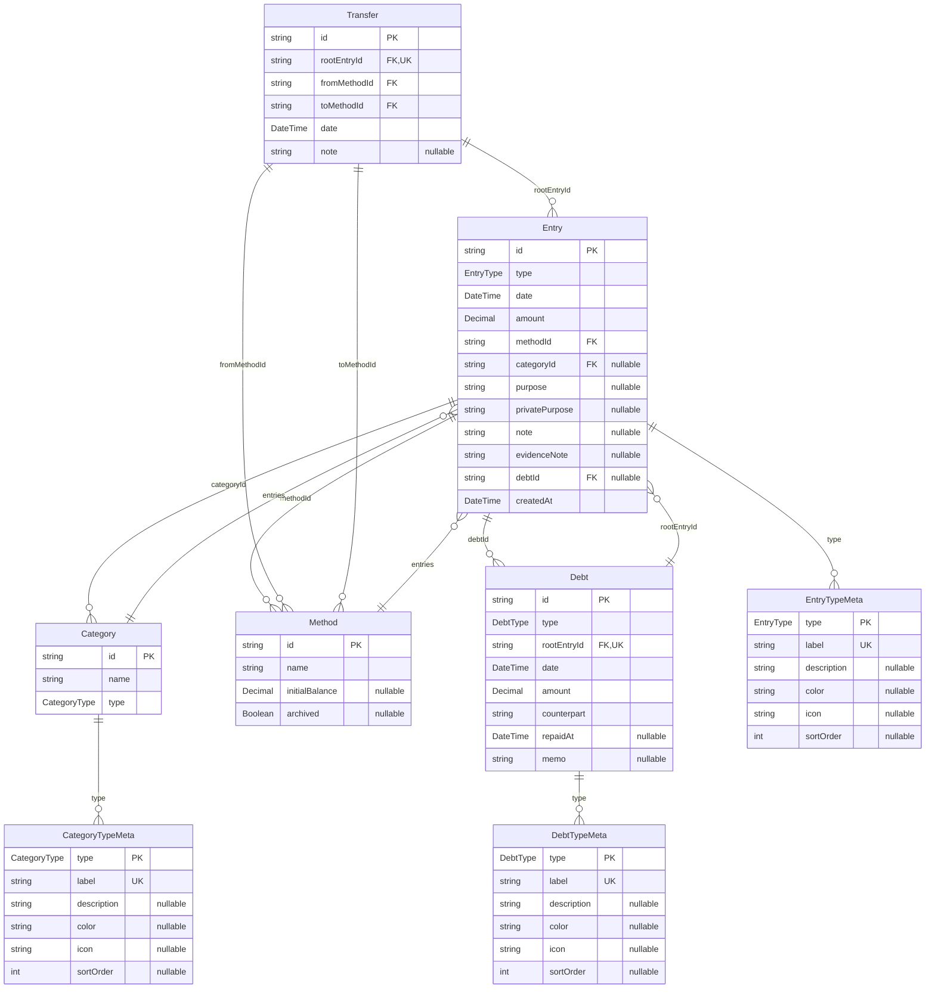

# 🧩 データモデル設計（budget_book）

---

このドキュメントでは、budget_bookにおける主要なデータモデル（Prismaモデル相当）とその構造、リレーション、制約を定義する。  
実装ベースでのフィールド構成・制約・保存構造などを中心に記述する。

---

## 📄 Entry（収支記録）

収支・借入・貸付・返済など金銭の流れを記録する基本単位。

| フィールド名       | 型       |?  | 説明 |
|--------------------|----------|----|------|
| `id`              | string   | ❌ | 主キー |
| `type`            | EntryType | ❌ | 種別（Zod Enum） |
| `date`            | DateTime | ❌ | 発生日（ローカルタイム） |
| `amount`          | Decimal  | ❌ | 金額（正数） |
| `methodId`        | string   | ❌ | 支払い手段（Method.id） |
| `categoryId`      | string   | ✅ | カテゴリ（任意、収支系のみ） |
| `purpose`         | string   | ✅ | 表向きの使途。詳細な内容ありうる |
| `privatePurpose`  | string   | ✅ | 非公開の実際の使途。UI非表示・集計対象外 |
| `note`            | string   | ✅ | 補足情報・文脈用の自由記述 |
| `evidenceNote`    | string   | ✅ | 証憑情報。**URIの場合、必ずアプリ内保存リソースである必要がある** |
| `debtId`          | string   | ✅ | 紐づくDebtのID（返済・借入関連） |
| `createdAt`       | DateTime | ❌ | 作成日時 |

---

## 💳 Debt（貸借管理）

借入／貸付の記録とその状態管理。

| フィールド名       | 型       |?  | 説明 |
|--------------------|----------|----|------|
| `id`              | string   | ❌ | 主キー |
| `type`            | DebtType | ❌ | 借入／貸付の種別 |
| `rootEntryId`     | string   | ❌ | 起点となるEntryのID |
| `date`            | DateTime | ❌ | 発生日 |
| `amount`          | Decimal  | ❌ | 金額 |
| `counterpart`     | string   | ❌ | 相手（名前 or 識別子） |
| `repaidAt`        | DateTime | ✅ | 返済完了日 |
| `memo`            | string   | ✅ | 備考欄（補足情報） |

---

## 💰 Method（支払い手段）

支払い元・手段（現金、口座、電子マネーなど）を表す。

| フィールド名       | 型       |?  | 説明 |
|--------------------|----------|----|------|
| `id`              | string   | ❌ | 主キー |
| `name`            | string   | ❌ | 表示名 |
| `initialBalance`  | Decimal  | ✅ | 初期残高（任意） |
| `archived`        | boolean  | ✅ | 使用停止状態か |

---

## 🔄 Transfer（振替）

振替の記録を表す。

| フィールド名       | 型       |?  | 説明 |
|--------------------|----------|----|------|
| `id`              | string   | ❌ | 主キー |
| `rootEntryId`     | string   | ❌ | 紐づくEntryのID |
| `fromMethodId`    | string   | ❌ | 振替元のMethod ID |
| `toMethodId`      | string   | ❌ | 振替先のMethod ID |
| `date`            | DateTime | ❌ | 振替日 |
| `note`            | string   | ✅ | 備考欄 |

---

## 📂 Category（カテゴリ）

UI編集可能なカテゴリ群（支出・収入の分類）。

| フィールド名       | 型       |?  | 説明 |
|--------------------|----------|----|------|
| `id`              | string   | ❌ | 主キー |
| `name`            | string   | ❌ | 表示名 |
| `type`            | CategoryType | ❌ | カテゴリ種別 |

---

## 📊 Metaデータモデル

### EntryTypeMeta

| フィールド名       | 型       |?  | 説明 |
|--------------------|----------|----|------|
| `type`            | EntryType | ❌ | 主キー |
| `label`           | string   | ❌ | 表示ラベル |
| `description`     | string   | ✅ | 説明 |
| `color`           | string   | ✅ | 表示色 |
| `icon`            | string   | ✅ | アイコン |
| `sortOrder`       | int      | ✅ | 並び順 |

---

### DebtTypeMeta

| フィールド名       | 型       |?  | 説明 |
|--------------------|----------|----|------|
| `type`            | DebtType | ❌ | 主キー |
| `label`           | string   | ❌ | 表示ラベル |
| `description`     | string   | ✅ | 説明 |
| `color`           | string   | ✅ | 表示色 |
| `icon`            | string   | ✅ | アイコン |
| `sortOrder`       | int      | ✅ | 並び順 |

---

### CategoryTypeMeta

| フィールド名       | 型       |?  | 説明 |
|--------------------|----------|----|------|
| `type`            | CategoryType | ❌ | 主キー |
| `label`           | string   | ❌ | 表示ラベル |
| `description`     | string   | ✅ | 説明 |
| `color`           | string   | ✅ | 表示色 |
| `icon`            | string   | ✅ | アイコン |
| `sortOrder`       | int      | ✅ | 並び順 |

---

## 📌 備考

- `evidenceNote` にURIを指定する場合、それは `public/storage/receipt/` に保存されたアプリ内部リソースである必要がある
- Prismaにおいては、各モデルに `@@map` / `@relation` / `@default` などを適宜設定する

---

## 🖼 ER図

以下はモデル間のリレーションを示すER図である。

---

以上が現時点でのデータモデル定義です。
