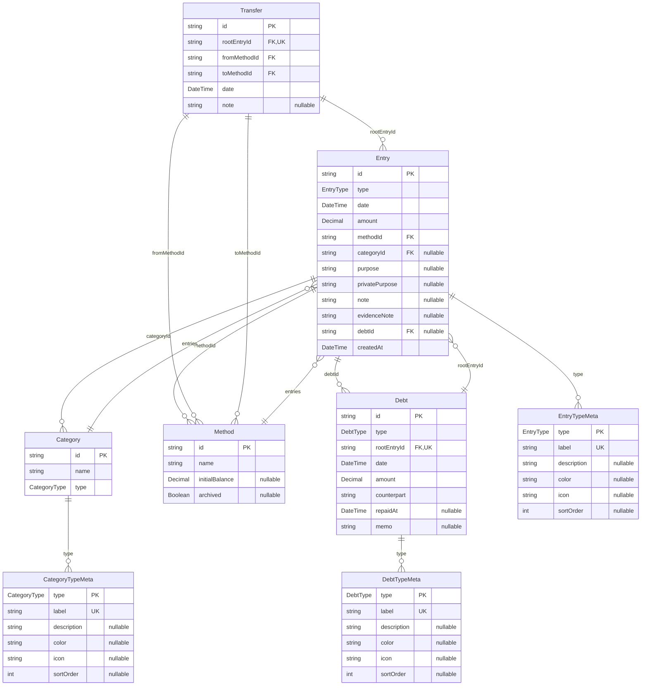

# 🧩 データモデル設計（budget_book）

---

このドキュメントでは、budget_bookにおける主要なデータモデル（Prismaモデル相当）とその構造、リレーション、制約を定義する。  
実装ベースでのフィールド構成・制約・保存構造などを中心に記述する。

---

## 📝 ID・型の管理方針

### ID管理
- **すべてのエンティティIDはUUIDv4形式**
  - すべての`id`フィールドは文字列型のUUIDv4として実装
  - 新規作成時には`crypto.randomUUID()`による自動生成を基本とする
  - PrismaではDBレベルでも`@default(uuid())`を設定し、一貫性を保証

### カスタム列挙型
- **ドメイン固有の列挙型を使用**
  - EntryType、DebtType、CategoryTypeなど、ドメイン固有の概念はTypeScript/Zodの列挙型として厳密に定義
  - 文字列リテラル型とTypeScriptのenumを組み合わせて型安全性を確保
  - 各列挙型は`src/shared/types/`ディレクトリで一元管理し、一貫したインポートパスを提供

### 型の整合性保証
- **Zodスキーマによる検証**
  - すべてのモデルはZodスキーマによる厳密な型検証を行う
  - UUIDの形式検証は`z.string().uuid()`で実施
  - 列挙型は`z.nativeEnum(EntryType)`などで検証し、有効な値のみを許容

---

## 📋 バリデーションとドメインルールの責任分担

budget_bookでは、以下の責任分担に基づいてバリデーションとドメインルールを管理しています：

### Zodスキーマの役割
- 基本的なデータ型・形式の検証（UUIDの形式、日付型など）
- フォームやAPI入力の検証
- 必須フィールドやオプショナルフィールドの定義

### ドメインモデルの役割
- ビジネスルールと不変条件の検証
  - 金額が0より大きいことの検証
  - 日付の整合性（返済日が借入日より後であることなど）
  - 同一口座間の振替禁止などの制約
- エンティティのライフサイクル管理
- ドメイン特有の計算ロジック

この明確な責任分担により、ビジネスルールの一貫性を保ちつつ、入力検証と不変条件を分離して管理できます。

---

## 📄 Entry（収支記録）

収支・借入・貸付・返済など金銭の流れを記録する基本単位。

| フィールド名       | 型       |?  | 説明 |
|--------------------|----------|----|------|
| `id`              | string   | ❌ | 主キー |
| `type`            | EntryType | ❌ | 種別（Zod Enum） |
| `date`            | DateTime | ❌ | 発生日（ローカルタイム） |
| `amount`          | Decimal  | ❌ | 金額（正数） |
| `methodId`        | string   | ❌ | 支払い手段（Method.id） |
| `categoryId`      | string   | ✅ | カテゴリ（任意、収支系のみ） |
| `purpose`         | string   | ✅ | 表向きの使途。詳細な内容ありうる |
| `privatePurpose`  | string   | ✅ | 非公開の実際の使途。UI非表示・集計対象外 |
| `note`            | string   | ✅ | 補足情報・文脈用の自由記述 |
| `evidenceNote`    | string   | ✅ | 証憑情報。**URIの場合、必ずアプリ内保存リソースである必要がある** |
| `debtId`          | string   | ✅ | 紐づくDebtのID（返済・借入関連） |
| `createdAt`       | DateTime | ❌ | 作成日時 |

### 不変条件
- `amount > 0` (ドメインモデルで検証)
- `type`が`borrow` / `lend`の場合、`debtId`は必須 (スキーマとドメインモデルで検証)
- `type`が`repayment` / `repay_received` の場合も、`debtId`は必須 (スキーマとドメインモデルで検証)
- `type`が`transfer` の場合、対応するTransferモデルが存在する必要がある (アプリケーション層で保証)

---

## 💳 Debt（貸借管理）

借入／貸付の記録とその状態管理。

| フィールド名       | 型       |?  | 説明 |
|--------------------|----------|----|------|
| `id`              | string   | ❌ | 主キー |
| `type`            | DebtType | ❌ | 借入／貸付の種別 |
| `rootEntryId`     | string   | ❌ | 起点となるEntryのID |
| `date`            | DateTime | ❌ | 発生日 |
| `amount`          | Decimal  | ❌ | 金額 |
| `counterpart`     | string   | ❌ | 相手（名前 or 識別子） |
| `repaidAt`        | DateTime | ✅ | 返済完了日 |
| `memo`            | string   | ✅ | 備考欄（補足情報） |

### 不変条件
- `amount > 0` (ドメインモデルで検証)
- 返済日がある場合、`date <= repaidAt` (ドメインモデルで検証)
- `rootEntryId`の`type`は`borrow`または`lend`であること (アプリケーション層で保証)

---

## 💰 Method（支払い手段）

支払い元・手段（現金、口座、電子マネーなど）を表す。

| フィールド名       | 型       |?  | 説明 |
|--------------------|----------|----|------|
| `id`              | string   | ❌ | 主キー |
| `name`            | string   | ❌ | 表示名 |
| `initialBalance`  | Decimal  | ✅ | 初期残高（任意） |
| `archived`        | boolean  | ✅ | 使用停止状態か |

### 不変条件
- `name`は空文字列でないこと (スキーマで検証)
- `name`は50文字以内であること (スキーマで検証)
- アーカイブされた状態の場合、新規Entryでの使用不可 (アプリケーション層で保証)

---

## 🔄 Transfer（振替）

振替の記録を表す。

| フィールド名       | 型       |?  | 説明 |
|--------------------|----------|----|------|
| `id`              | string   | ❌ | 主キー |
| `rootEntryId`     | string   | ❌ | 紐づくEntryのID |
| `fromMethodId`    | string   | ❌ | 振替元のMethod ID |
| `toMethodId`      | string   | ❌ | 振替先のMethod ID |
| `date`            | DateTime | ❌ | 振替日 |
| `note`            | string   | ✅ | 備考欄 |

### 不変条件
- `fromMethodId !== toMethodId` (ドメインモデルで検証)
- `rootEntryId`の`type`は`transfer`であること (アプリケーション層で保証)
- 振替元の残高が振替金額以上であること (リポジトリ層で検証)

---

## 📂 Category（カテゴリ）

UI編集可能なカテゴリ群（支出・収入の分類）。

| フィールド名       | 型       |?  | 説明 |
|--------------------|----------|----|------|
| `id`              | string   | ❌ | 主キー |
| `name`            | string   | ❌ | 表示名 |
| `type`            | CategoryType | ❌ | カテゴリ種別 |

---

## 📊 Metaデータモデル

### EntryTypeMeta

| フィールド名       | 型       |?  | 説明 |
|--------------------|----------|----|------|
| `type`            | EntryType | ❌ | 主キー |
| `label`           | string   | ❌ | 表示ラベル |
| `description`     | string   | ✅ | 説明 |
| `color`           | string   | ✅ | 表示色 |
| `icon`            | string   | ✅ | アイコン |
| `sortOrder`       | int      | ✅ | 並び順 |

---

### DebtTypeMeta

| フィールド名       | 型       |?  | 説明 |
|--------------------|----------|----|------|
| `type`            | DebtType | ❌ | 主キー |
| `label`           | string   | ❌ | 表示ラベル |
| `description`     | string   | ✅ | 説明 |
| `color`           | string   | ✅ | 表示色 |
| `icon`            | string   | ✅ | アイコン |
| `sortOrder`       | int      | ✅ | 並び順 |

---

### CategoryTypeMeta

| フィールド名       | 型       |?  | 説明 |
|--------------------|----------|----|------|
| `type`            | CategoryType | ❌ | 主キー |
| `label`           | string   | ❌ | 表示ラベル |
| `description`     | string   | ✅ | 説明 |
| `color`           | string   | ✅ | 表示色 |
| `icon`            | string   | ✅ | アイコン |
| `sortOrder`       | int      | ✅ | 並び順 |

---

## 📌 備考

- `evidenceNote` にURIを指定する場合、それは `public/storage/receipt/` に保存されたアプリ内部リソースである必要がある
- Prismaにおいては、各モデルに `@@map` / `@relation` / `@default` などを適宜設定する

---

## 🖼 ER図

以下はモデル間のリレーションを示すER図である。

---

以上が現時点でのデータモデル定義です。
